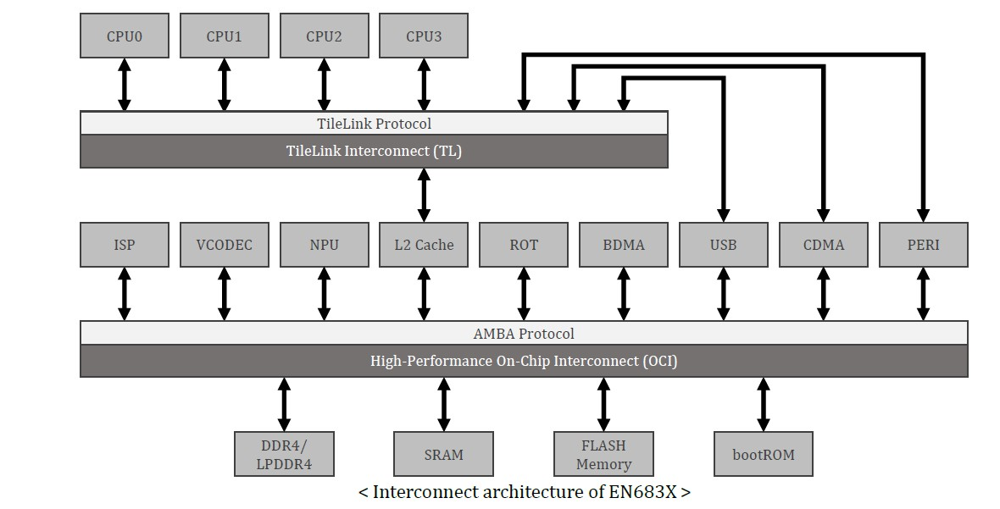
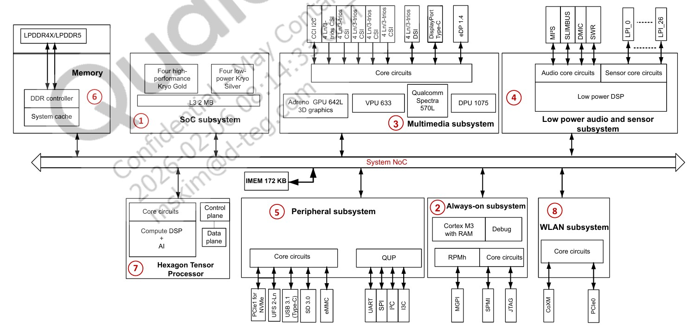
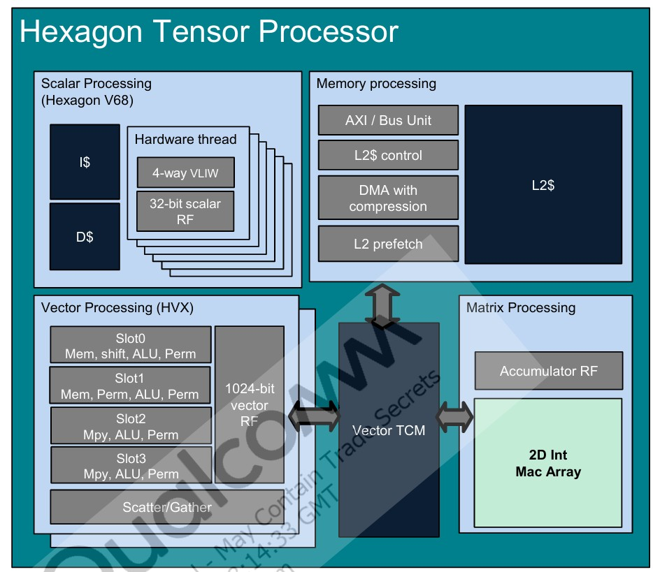
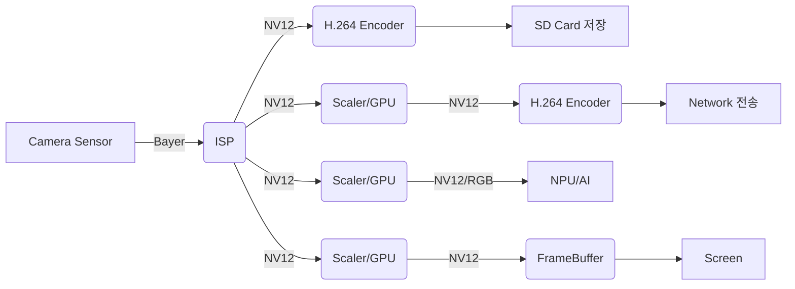
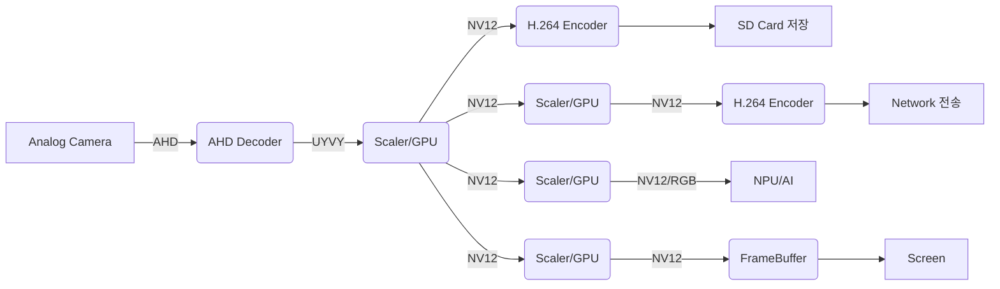
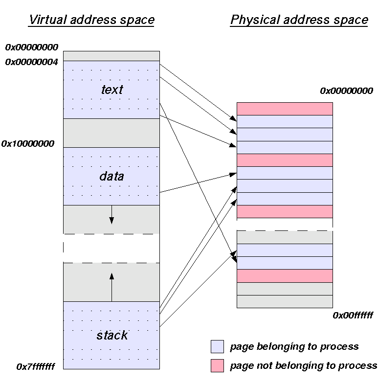
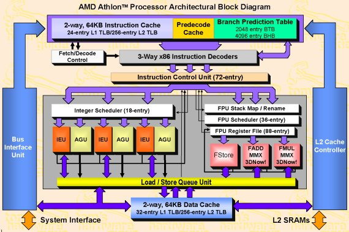

# NPU를 포함한 SOC 분석
## EN683 구조

* CPU
  + Core 0~3 : 32KB I/D-cache
  + L2 Cache : 512KB
* NPU
  + SRAM : 2MB

## [QCS6490](https://www.qualcomm.com/internet-of-things/products/q6-series/qcs6490) 구조

* CPU
  + Silver Cores (x4)
      - L1 cache : 32KB I/D
      - L2 cache : 128KB
  + Gold Cores (x3), Prime Core (x1)
      - L1 cache : 32KB I/D
      - L2 cache : 128KB
  + L3 cache : 2MiB
* HTP(NPU, hexagon dsp)
  + 1MB L2 cache
  + vTCM : 2MB


## Video Pipe Line
* Internal Camera

* External Camera


# Linux Application 운영 환경
## [linux virtual address space layout](https://www.google.com/search?q=linux+virtual+address+space+layout)

32bit architecture


64bit architecture


* "physical memory map" vs "virtual memory map"
  + physical memory map은 SOC 마다 다름
  + physical memory 구성 요소
    - SDRAM
    - PCIe
    - peripheral registers (memory mapped io)
  + linux kernel은 MMU를 사용하여 상위 virtual memory space에 physical memory를 전부 mapping (재배치)
  + 최근의 SOC에서 모든 HW resource를 memory라고 해도 과언이 아님
    - [linux kernel memory barriers](https://www.kernel.org/doc/Documentation/memory-barriers.txt)
  + [MMU](https://en.wikipedia.org/wiki/Memory_management_unit)
    - page단위(보통 4KiB)로 관리 : https://man7.org/linux/man-pages/man2/getpagesize.2.html
    - atrributes : cacheable, write combine flag, rwx flag, ...
  + [DMA](https://en.wikipedia.org/wiki/Direct_memory_access)
    - FIFO : cpu가 device의 data register를 통해 memory 전송
    - DMA는 cpu의 도움없이 직접 memory에 access : cpu는 제어만
    - 메모리 fragmentation 문제 (DMA access는 보통 연속된 physical address를 요구)
      - Scatter-Gather Direct Memory Access : device가 지원해야함 (예: AHCI SD Host controller)
      - [IOMMU](https://en.wikipedia.org/wiki/Input%E2%80%93output_memory_management_unit) : device용 MMU (SOC가 지원해야함)
      - Linux CMA(Contiguous Memory Allocator) : booting 초기 일부 devicetree로 설정된 영역을 reserve
      - Memory중 일부를 Linux에 관리하는 영역에서 제거하고 특정 Device 전용으로 사용
    - 일부 Device는 HW적으로 특정 영역만 access가능
* "kernel memory space" vs "user memory space"
  + kernel memory mapping은 1개만 존재
  + user space memory mapping은 process마다 1개씩 생성
    
    - process간 memory protection
    - thread는 동일한 memory mapping 공유
    - kernel thread는 kernel memory mapping 사용
    - process 전환시 user space memory mapping만 바꿈
    - user space memory mapping은 physical address뿐만 아니라 file도 mapping
  + kernel api(open,close,read,write,ioctl,poll....) call시 memory mapping 전환 불필요
    - interrupt 처리 시에도 memory mapping 전환 불필요

## User Space Application 메모리 맵
https://wxdublin.gitbooks.io/deep-into-linux-and-beyond/content/address_space.html

* process memory map 확인 방법
  ```shell
  cat /proc/[pid]/maps
  ```
  + 자신의 memory map
    ```shell
    /proc/self/maps
    ```
* ELF file format : https://stackoverflow.com/questions/14361248/whats-the-difference-of-section-and-segment-in-elf-file-format
  
  + elf file 정보 확인 방법 : [readelf](https://man7.org/linux/man-pages/man1/readelf.1.html)
    - pre-linked shared library 확인 방법
      ```shell
      readelf -d [executable file or shared library]
      ```
* [demand paging](https://en.wikipedia.org/wiki/Demand_paging)
  + Text segment, ro data, 및 ro memory mapping segment는 실제 사용할 때만 메모리에 적재한다. 메모리 사용량의 증가에 따라서 최근에 접근하지 않은 page는 메모리에서 제거하고 필요시 다시 적재 : [swapping](https://en.wikipedia.org/wiki/Memory_paging)
  + 항상 메모리에 적재해야할 경우 [mlock](https://man7.org/linux/man-pages/man2/mlock.2.html) api 사용
    - swapping 방지
    - realtime : latency 보장
    - 보안 : encryption key 유출 방지
  + [mmap](https://man7.org/linux/man-pages/man2/mmap.2.html) : file을 virtual memory space에 mapping
    ```c
    #include <sys/mman.h>
    void *mmap(size_t length, void *addr, size_t length, int prot, int flags, int fd, off_t offset);
    int munmap(size_t length, void *addr, size_t length);
    ```

# 메모리/data 관련한 여러가지 주의사항
## Register <-> L1/L2/L3 cache <-> SDRAM 구조 이해


* Big Little CPU architecture
* register
  + variable, pointer, data를 처리하기 위해
  + volatile
    - 지정된 variable/pointer 의 register 사용 관련 optimization off
    - access시 마다 재 load하는 코드를 생성하도록 제어
    - micom이외 최근의 SOC에서는 volatile 만으로 불충분 (cache,write buffer및 access order등의 문제)
    - linux kernel의 device access macro : readl(...) writel(...)
* cache
  + cache vs TCM(Tightly Coupled Memory)
    - cache : memory space에 포함되지 않음
    - TCM : main memory의 일종
  + kernel에서 아주 제한된 제어만 가능
    - MMU에 cache할 영역 설정
    - DMA coherence 관련 : DMA를 지원하는 디바이스(VPU/DPU/GPU/NPU/....)와 데이타 교환을 위해
      - invalidate : 변경된 SDRAM의 data로 기존 cache영역을 refresh
      - flush : 변경된 cache의 data를 SDRAM에 저장
      - user space에서는 device driver가 제공하는 api로 제어
        - v4l2 : [DMA_BUF_IOCTL_SYNC](https://docs.kernel.org/driver-api/dma-buf.html)
        - novatek : hd_common_mem_flush_cache
  + cache line size : 64bytes ??
    - https://stackoverflow.com/questions/794632/programmatically-get-the-cache-line-size
* SDRAM
  + [addressing latency](https://www.google.com/search?q=addressing+latency+in+sdram)
  + [burst mode](https://www.google.com/search?q=burst+mode+in+sdram)
  + 최대 성능을 내려면 sequential access해야함

## Data Alignment
* 32bit vs 64bit system의 c/c++ type별 크기(bytes)
  |        | char | short | int | long | long long | float | double | pointer
  |---     |---   |---    |---  |---   |---        |---    |---     |---
  | 32 bit | 1    | 2     | 4   | 4    | 8         | 4     | 8      | 4
  | 64 bit | 1    | 2     | 4   | 8    | 8         | 4     | 8      | 8
  + pointer와 integer type간의 cast시에는 long을 사용해야 compatiblity issue가 없음
* aligned access(intel계열 cpu 제외)
  + 기본 type의 data 시작 address는 type의 크기에 맞게 align되어 있어야함
    - 예외 : __attribute__((packed)) syntax
    - 가능하면 사용하지 말자 : 급격한 속도 저하
  + 32bit system에서는 최대 4byte align ????????
* structure의 member는 data type에 맞게 align됨
  + 예1
    ```c
    struct {
      int8_t a;
      // 3bytes padding
      int32_t b;
    };
    ```
    - structure의 크기는 8byte임
  + 예2
    ```c
    struct A {
      int16_t a;
      // 2bytes padding
      int32_t b;
      int16_t c;
      // 2bytes padding ??
    };
    struct A {
      int16_t a;
      int16_t c;
      int32_t b;
    };
    ```
    - structure A의 크기 12 bytes
    - structure B의 크기 8 bytes
* data를 강제로 align하기
  + [c/c++11 _Alignas/alignas](https://learn.microsoft.com/en-us/cpp/c-language/alignment-c?view=msvc-170)
* [malloc](https://man7.org/linux/man-pages/man3/malloc.3.html)
  ```
  The malloc(), calloc(), realloc(), and reallocarray() functions
  return a pointer to the allocated memory, which is suitably
  aligned for any type that fits into the requested size or less.
  ```
* aligned memory allocation
  + [posix_memalign](https://man7.org/linux/man-pages/man3/posix_memalign.3.html)
  + [c11 aligned_alloc](https://en.cppreference.com/w/c/memory/aligned_alloc)

## Memory management
* [c/c++ 사용 중 흔한 메모리 오류](https://valgrind.org/docs/manual/mc-manual.html)
  + Illegal read / Illegal write errors
    - stack smashing
  + Use of uninitialised values : 필요없는 상황에서도 variable 선언 시 초기화
  + access after free : delete/free후 NULL, nullptr로 설정
  + memory leak
  + Illegal frees
* c++ smart pointers
  + free/delete 불필요 : memory leak, Illegal frees, access after free 방지
  + std::unique_ptr : 한 object에 오직 하나의 pointer만 허용
    - std::move : 소유권 이전
  + std::shared_ptr : 한 object에 여러 pointer 허용
    - reference count(thread safe)가 0이 되면 자동 delete
    - std::weak_ptr : reference count에 영향을 미치지 않는 pointer

# multi process/thread 및 data/memory 공유