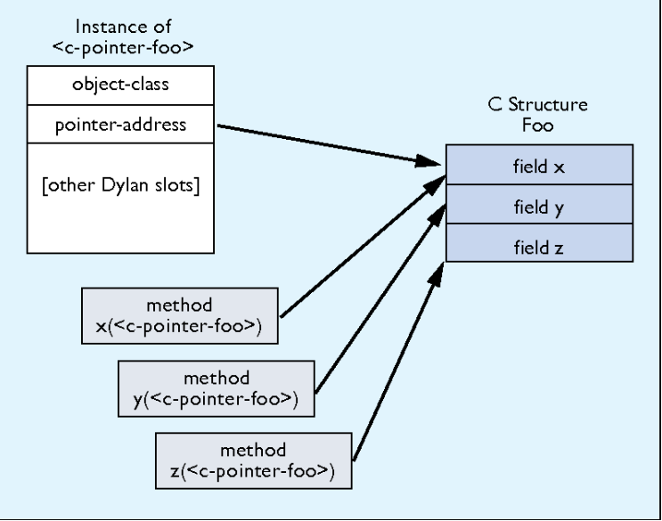

# API/Plugin

## Primitive Shared Library API
### Qualcomm QNN Library
* "QnnInterface_getProviders"로 부터 출발
  ```c
  typedef Qnn_ErrorHandle_t (*QnnInterfaceGetProvidersFn_t)(const QnnInterface_t*** providerList, uint32_t* numProviders);
  
  typedef struct {
    QnnProperty_HasCapabilityFn_t             propertyHasCapability;

    QnnBackend_CreateFn_t                     backendCreate;
    QnnBackend_SetConfigFn_t                  backendSetConfig;
    QnnBackend_GetApiVersionFn_t              backendGetApiVersion;
    QnnBackend_GetBuildIdFn_t                 backendGetBuildId;
    // ....
  } QNN_INTERFACE_VER_TYPE;
  typedef struct {
    uint32_t backendId;
    const char* providerName;
    Qnn_ApiVersion_t apiVersion;
    union UNNAMED {
      QNN_INTERFACE_VER_TYPE  QNN_INTERFACE_VER_NAME;
    };
  } QnnInterface_t;

  // ...
  QnnInterfaceGetProvidersFn_t getInterfaceProviders =
    (QnnInterfaceGetProvidersFn_t) dlsym(lib_backend_handle, "QnnInterface_getProviders");
  // ...
  ret = getInterfaceProviders((const QnnInterface_t***)&interfaceProviders, &numProviders);
  // ...
  /* find exactly matched version */
  for (uint32_t pIdx = 0; pIdx < numProviders; pIdx++) {
    if (QNN_API_VERSION_MAJOR == interfaceProviders[pIdx]->apiVersion.coreApiVersion.major &&
        QNN_API_VERSION_MINOR == interfaceProviders[pIdx]->apiVersion.coreApiVersion.minor)
    {
      // ...
      return std::shared_ptr<QnnInterface>(self);
    }
  }
  /* find upper version */
  for (uint32_t pIdx = 0; pIdx < numProviders; pIdx++) {
    if (QNN_API_VERSION_MAJOR == interfaceProviders[pIdx]->apiVersion.coreApiVersion.major &&
        QNN_API_VERSION_MINOR < interfaceProviders[pIdx]->apiVersion.coreApiVersion.minor)
    {
      // ...
      return std::shared_ptr<QnnInterface>(self);
    }
  }
  ```
* api version 확인 후 사용
  + major version이 다르면 호환되지 않음
  + minor version이 다르면 호환되지만, 새로운 기능이 추가되었을 수 있음
    - QNN_INTERFACE_VER_TYPE 뒤에 새롭게 추가
* 기능에 따라 API interface를 처음 부터 새로 정의해야
  + QnnInterface_getProviders
  + QnnSystemInterface_getProviders

## [COM (Component Object Model)](https://learn.microsoft.com/en-us/windows/win32/com/component-object-model--com--portal)

* Microsoft Windows에서 software component를 개발하기 위한 binary-interface standard
  + Interfaces : define feature contracts (IUnknown으로 부터 상속)
    - components : implement interfaces
  + Servers : provide components to the system
  + Clients : use the features provided by components
  + **registry** : tracks where components are deployed on local and remote hosts
* IUnknown interface
  + 모든 COM interface는 IUnknown에서 상속
  + reference counting 방식의 메모리 관리
    - AddRef() : reference count 증가
    - Release() : reference count 감소, 0이 되면 object의 메모리 해제
  + QueryInterface() : component가 지원하는 interface를 query하여 pointer를 반환

## [GStreamer](https://gstreamer.freedesktop.org/)
### GObject를 기반으로 하는 object oriented C library로 multimedia data를 처리하기 위한 framework
  + member function, inheritance를 c로 구현
  + 수동 reference counting 방식의 object의 메모리 관리
    - g_object_ref(...) : reference count 증가
    - g_object_unref() : reference count 감소, 0이 되면 object의 메모리 해제
### [GstPipeline](https://gstreamer.freedesktop.org/documentation/gstreamer/gstpipeline.html?gi-language=c) : 여러 element(plugin)를 연결하여 multimedia data flow를 구성하는 단위

  
  + 한 process에 여러개의 pipeline 가능
### [GstPlugin](https://gstreamer.freedesktop.org/documentation/gstreamer/gstplugin.html?gi-language=c#GstPlugin)
  + plugin은 shared library로 구현
  + 보통 자동으로 load됨
  + element factory를 제공하여 element의 생성과 초기화를 담당
### [GstElement](https://gstreamer.freedesktop.org/documentation/gstreamer/gstelement.html?gi-language=c) : multimedia data를 처리하는 모듈

  
  + element는 property, signal, pad를 가질 수 있음
    - property : element의 동작을 제어하는 parameter
    - signal : element에서 발생하는 event
    - pad : element의 input/output interface
  + 예 : GObject → GstObject → GstElement → GstVideoEncoder → GstV4l2VideoEnc → v4l2h264enc
### [GstBuffer](https://gstreamer.freedesktop.org/documentation/gstreamer/gstbuffer.html?gi-language=c)
  + multimedia buffer의 abstract representation
  + element에서 생성, 처리된 후 pad를 통해 전달
  + [GstMemory](https://gstreamer.freedesktop.org/documentation/gstreamer/gstmemory.html?gi-language=c)와 [GstMeta](https://gstreamer.freedesktop.org/documentation/gstreamer/gstmeta.html?gi-language=c)로 구성
    - GstMemory : multimedia data가 저장된 memory block에 대한자정보
    - GstMeta : multimedia data에 대한 추가 정보(metadata) : timestamp, object detection 결과, ...
### 장/단점
  + 장점
    - 필요한 기능을 plugin 형태로 쉽게 확장 가능
    - 다양한 기존 plugin 재사용 가능
  + 단점
    - 복잡한 구조
    - heavy dependency


## [Pipewire Simple Plugin API](https://docs.pipewire.org/page_spa.html)
### [Pipewire introduction](https://bootlin.com/blog/an-introduction-to-pipewire/)
  
### Design
  + Types
    - String types
    - Integer types
  + Error Codes : negative integer
### Plugins
  + Design Overview
    - No implicit dependencies, SPA is shipped as a set of header files that have no dependencies except for the standard C library.
    - Extensible; new API can be added with minimal effort, existing API can be updated and versioned
  + Plugin usage
    - Load the shared library.
    - Enumerate the available factories.
    - Enumerate the interfaces in each factory.
    - Instantiate the desired interface.
    - Use the interface-specific functions.
  + Open A Plugin
    ```c
    #define SPA_PLUGIN_DIR  /usr/lib64/spa-0.2/"
    void *hnd = dlopen(SPA_PLUGIN_DIR"/support/libspa-support.so", RTLD_NOW);
    ```
    ```c
    #define 	SPA_HANDLE_FACTORY_ENUM_FUNC_NAME   "spa_handle_factory_enum"
    typedef int(* spa_handle_factory_enum_func_t) (const struct spa_handle_factory **factory, uint32_t *index)
    spa_handle_factory_enum_func_t enum_func;
    enum_func = dlsym(hnd, SPA_HANDLE_FACTORY_ENUM_FUNC_NAME));
    ```
  + Enumerating Factories
    ```c
    struct spa_handle_factory {
      uint32_t version;
      const char *name;
      // ....
    };

    uint32_t i;
    const struct spa_handle_factory *factory = NULL;
    for (i = 0;;) {
      if (enum_func(&factory, &i) <= 0)
        break;
      // check name and version, introspect interfaces,
      // do something with the factory.
    }
    ```
  + Making A Handle
    - get the size of the required memory
      ```c
      struct spa_dict *extra_params = NULL;
      size_t size = spa_handle_factory_get_size(factory, extra_params);
      ```
    - allocate the memory and initialize the object in it
      ```c
      struct spa_handle {
        uint32_t version;
        int (*get_interface) (struct spa_handle *handle, const char *type, void **iface);
        int (*clear) (struct spa_handle *handle);
      };

      struct spa_handle *handle = (struct spa_handle *) calloc(1, size);
      spa_handle_factory_init(factory, handle, extra_params/*info*/,  NULL/*support*/, 0 /*n_support*/);
      ```
      support/n_support : handle이 의존하는 다른 handle의 interface를 제공하기 위한 parameter, 보통은 NULL/0으로 설정
  + Clearing An Object
    - clear handle
      ```c
      spa_handle_clear(handle);
      free(handle);
      ```
    - close shared library
      ```c
      dlclose(hnd);
      ```
  + Node interface
    - retrieving interface
      ```c
      void *iface;
      spa_handle_get_interface(handle, SPA_TYPE_INTERFACE_Node, &iface);
      struct spa_node *node = iface;
      spa_node_process(node);
      ```
      ```c
      struct spa_node {
        struct spa_interface iface;
      };
      struct spa_interface {
        const char *type;
        uint32_t version;
        struct spa_callbacks cb;
      };
      struct spa_callbacks {
        const void *funcs;
        void *data;
      };
      ```
    - call interface method
      ```c
      SPA_API_NODE int spa_node_process_fast(struct spa_node *object)
      {
        return spa_api_method_fast_r(int, -ENOTSUP, spa_node, &object->iface, process, 0);
      }
      #define spa_callbacks_call(callbacks,type,method,vers,...)			\
      ({										\
        const type *_f = (const type *) (callbacks)->funcs;			\
        bool _res = SPA_CALLBACK_CHECK(_f,method,vers);				\
        if (SPA_LIKELY(_res))							\
          (_f->method)((callbacks)->data, ## __VA_ARGS__);		\
        _res;									\
      })
      ```
    - node interface methods
      ```c
      struct spa_node_methods {
      #define SPA_VERSION_NODE_METHODS	0
        uint32_t version;
        int (*add_listener) (void *object, struct spa_hook *listener, const struct spa_node_events *events, void *data);
        int (*set_callbacks) (void *object, const struct spa_node_callbacks *callbacks, void *data);
        int (*sync) (void *object, int seq);
        int (*enum_params) (void *object, int seq, uint32_t id, uint32_t start, uint32_t max, const struct spa_pod *filter);
        int (*set_param) (void *object, uint32_t id, uint32_t flags, const struct spa_pod *param);
        int (*set_io) (void *object, uint32_t id, void *data, size_t size);
        int (*send_command) (void *object, const struct spa_command *command);
        int (*add_port) (void *object, enum spa_direction direction, uint32_t port_id, const struct spa_dict *props);
        int (*remove_port) (void *object, enum spa_direction direction, uint32_t port_id);
        int (*port_enum_params) (void *object, int seq, enum spa_direction direction, uint32_t port_id, uint32_t id, uint32_t start, uint32_t max, const struct spa_pod *filter);
        int (*port_set_param) (void *object, enum spa_direction direction, uint32_t port_id, uint32_t id, uint32_t flags, const struct spa_pod *param);
        int (*port_use_buffers) (void *object, enum spa_direction direction, uint32_t port_id, uint32_t flags, struct spa_buffer **buffers, uint32_t n_buffers);
        int (*port_set_io) (void *object, enum spa_direction direction, uint32_t port_id, uint32_t id, void *data, size_t size);
        int (*port_reuse_buffer) (void *object, uint32_t port_id, uint32_t buffer_id);
        int (*process) (void *object);
      };
      ```

### SPA Buffer
* contains metadata and data
  ```c
  struct spa_buffer {
    uint32_t n_metas;		/**< number of metadata */
    uint32_t n_datas;		/**< number of data members */
    struct spa_meta *metas;		/**< array of metadata */
    struct spa_data *datas;		/**< array of data members */
  };
  ```
* spa_data
  ```c
  struct spa_data {
	uint32_t type;			/**< memory type, one of enum spa_data_type */
	uint32_t flags;			/**< data flags */
	int64_t fd;			/**< optional fd for data */
	uint32_t mapoffset;		/**< offset to map fd at, this is page aligned */
	uint32_t maxsize;		/**< max size of data */
	void *data;			/**< optional data pointer */
	struct spa_chunk *chunk;	/**< valid chunk of memory */
  };
  ```
* spa_meta
  ```c
  struct spa_meta {
	uint32_t type;		/**< metadata type, one of enum spa_meta_type */
	uint32_t size;		/**< size of metadata */
	void *data;		/**< pointer to metadata */
  };
  ```

### POD(Plain Old Data)
* message passing을 위한 data structure
* LTV(Length Type Value) format : Each POD is made of a 32 bits size followed by a 32 bits type field, followed by the POD contents
  ```c
  struct spa_pod {
    uint32_t size;          /* size of the body */
    uint32_t type;          /* a basic id of enum spa_type */
  };
  struct spa_pod_bool {
    struct spa_pod pod;
    int32_t value;
    int32_t _padding;
  };
  ```
  **The POD start is always aligned to 8 bytes : marhalling/unmarshalling이 필요없음**
* basic SPA types
  + SPA_TYPE_None: No value or a NULL pointer.
  + SPA_TYPE_Bool: A boolean value.
  + SPA_TYPE_Id: An enumerated value.
  + SPA_TYPE_Int, SPA_TYPE_Long, SPA_TYPE_Float, SPA_TYPE_Double: various numeral types, 32 and 64 bits.
  + SPA_TYPE_String: A string.
  + SPA_TYPE_Bytes: A byte array.
  + SPA_TYPE_Rectangle: A rectangle with width and height.
  + SPA_TYPE_Fraction: A fraction with numerator and denominator.
  + SPA_TYPE_Bitmap: An array of bits.
* container types
  + SPA_TYPE_Array: An array of equal sized objects.
  + SPA_TYPE_Struct: A collection of types and objects.
  + SPA_TYPE_Object: An object with properties.
    ```c
    struct spa_pod_object {
        struct spa_pod pod;
        struct spa_pod_object_body body;
    };
    struct spa_pod_object_body {
        uint32_t type;		/**< one of enum spa_type */
        uint32_t id;		/**< id of the object, depends on the object type */
        /* contents follow, series of spa_pod_prop */
    };
    struct spa_pod_prop {
        uint32_t key;			/**< key of property, list of valid keys depends on the object type */
        uint32_t flags;			/**< flags for property */
        struct spa_pod value;
        /* value follows */
    };
    ```
  + SPA_TYPE_Sequence: A timed sequence of POD's.
* extra types
  + SPA_TYPE_Pointer: A typed pointer in memory.
  + SPA_TYPE_Fd: A file descriptor.
  + SPA_TYPE_Choice: A choice of values.
  + SPA_TYPE_Pod: A generic type for the POD itself