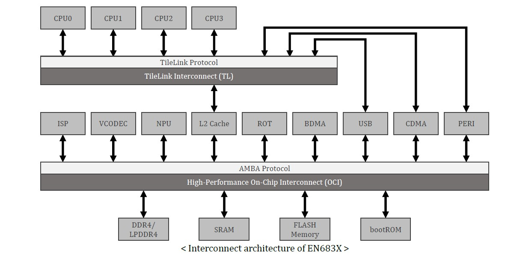
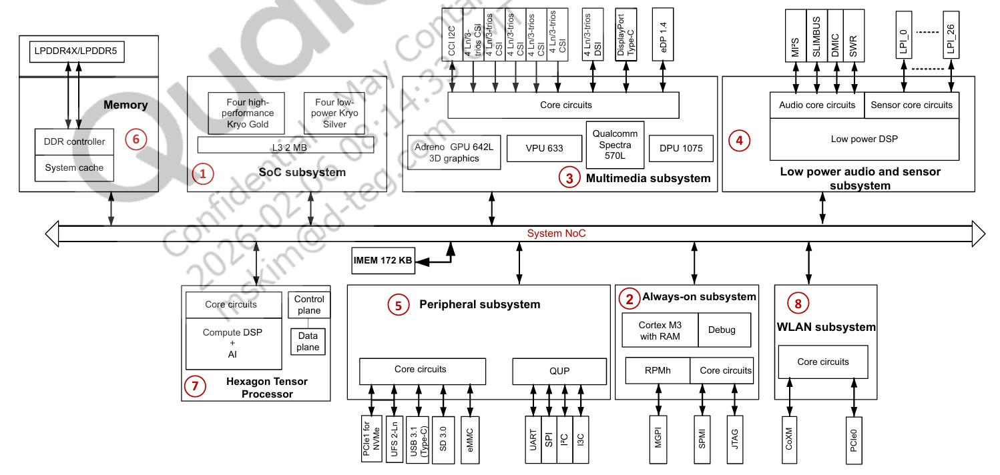
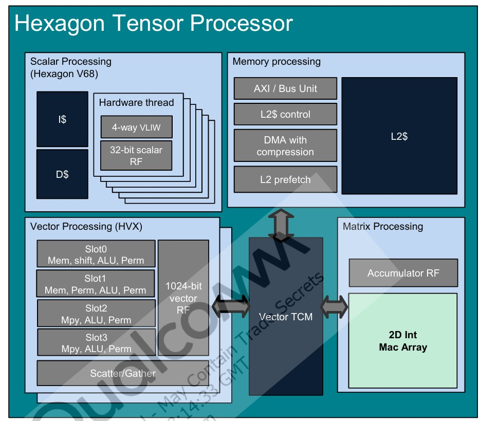
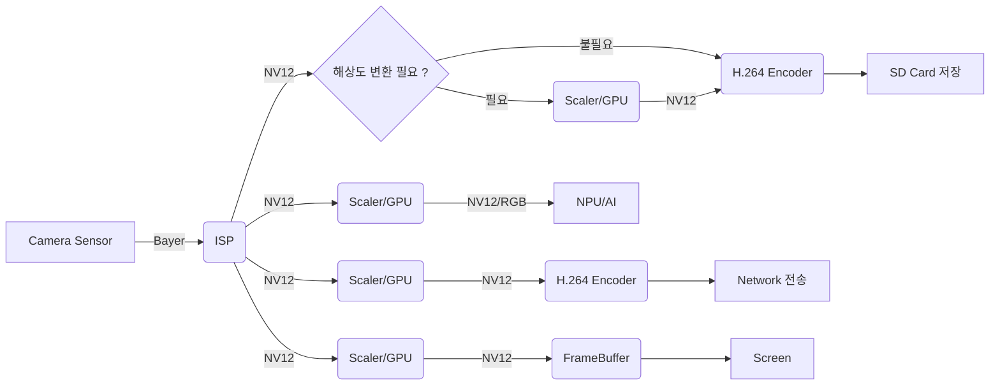
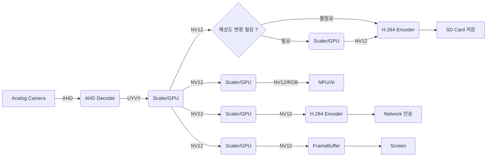
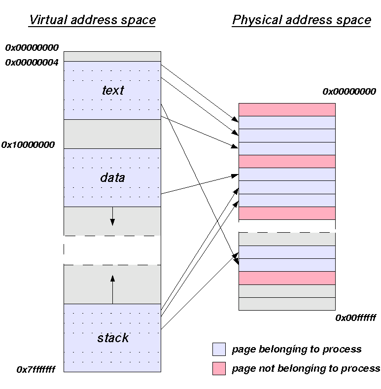
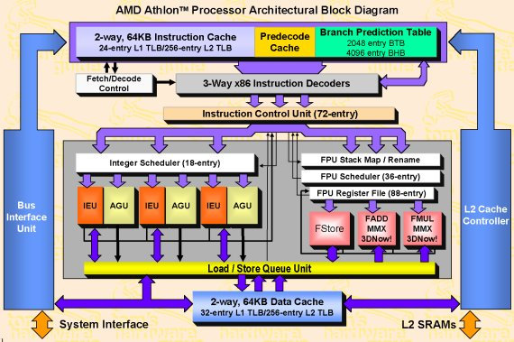

# NPU를 포함한 SOC 분석
## EN683 구조

* CPU
  + Core 0~3 : 32KB I/D-cache
  + L2 Cache : 512KB
* NPU
  + SRAM : 2MB

## [QCS6490](https://www.qualcomm.com/internet-of-things/products/q6-series/qcs6490) 구조

* CPU : Qualcomm® Kryo™ 670
  + Silver Cores (x4) : Cortex A55
      - L1 cache : 32KB I/D
      - L2 cache : 128KB
  + Gold Cores (x3), Prime Core (x1) : Cortex A78
      - L1 cache : 32KB I/D
      - L2 cache : 512KB
  + L3 cache : 2MiB
* HTP(NPU, hexagon dsp)
  + 1MB L2 cache
  + vTCM : 2MB


## Video Pipe Line
* Internal Camera

```mermaid
graph LR
A[Camera Sensor] -->|Bayer| C(ISP)
  C -->|NV12| N{해상도 변환 필요 ?}
  N -->|불필요| D
  N -->|필요| O(Scaler/GPU) --> |NV12| D
  D(H.264 Encoder) --> G[SD Card 저장]
  C -->|NV12| E(Scaler/GPU) -->|NV12| F(H.264 Encoder) --> H[Network 전송]
  C -->|NV12| I(Scaler/GPU) -->|NV12/RGB| J[NPU/AI]
  C -->|NV12| K(Scaler/GPU) -->|NV12| L(FrameBuffer) --> M[Screen]
```
* External Camera

```mermaid
graph LR
A[Analog Camera] -->|AHD| B(AHD Decoder) -->|UYVY| C(Scaler/GPU)
  C -->|NV12| N{해상도 변환 필요 ?}
  N -->|불필요| D
  N -->|필요| O(Scaler/GPU) --> |NV12| D
  D(H.264 Encoder) --> G[SD Card 저장]
  C -->|NV12| E(Scaler/GPU) -->|NV12| F(H.264 Encoder) --> H[Network 전송]
  C -->|NV12| I(Scaler/GPU) -->|NV12/RGB| J[NPU/AI]
  C -->|NV12| K(Scaler/GPU) -->|NV12| L(FrameBuffer) --> M[Screen]
```

# Linux Application 운영 환경
## [linux virtual address space layout](https://www.google.com/search?q=linux+virtual+address+space+layout)

32bit architecture


64bit architecture


* "physical memory map" vs "virtual memory map"
  + physical memory map은 SOC 마다 다름
  + physical memory 구성 요소
    - SDRAM
    - PCIe
    - peripheral registers (memory mapped io)
  + linux kernel은 MMU를 사용하여 상위 virtual memory space에 physical memory를 전부 mapping (재배치)
  + 최근의 SOC에서 모든 HW resource를 memory라고 해도 과언이 아님
    - [linux kernel memory barriers](https://www.kernel.org/doc/Documentation/memory-barriers.txt)
  + [MMU](https://en.wikipedia.org/wiki/Memory_management_unit)
    - page단위(보통 4KiB)로 관리 : https://man7.org/linux/man-pages/man2/getpagesize.2.html
    - atrributes : cacheable, write combine flag, rwx flag, ...
  + [DMA](https://en.wikipedia.org/wiki/Direct_memory_access)
    - FIFO : cpu가 device의 data register를 통해 memory 전송
    - DMA는 cpu의 도움없이 직접 memory에 access : cpu는 제어만
    - 메모리 fragmentation 문제 (DMA access는 보통 연속된 physical address를 요구)
      - Scatter-Gather Direct Memory Access : device가 지원해야함 (예: AHCI SD Host controller)
      - [IOMMU](https://en.wikipedia.org/wiki/Input%E2%80%93output_memory_management_unit) : device용 MMU (SOC가 지원해야함)
      - Linux CMA(Contiguous Memory Allocator) : booting 초기 일부 devicetree로 설정된 영역을 reserve
      - Memory중 일부를 Linux에 관리하는 영역에서 제거하고 특정 Device 전용으로 사용
    - 일부 Device는 HW적으로 특정 영역만 access가능
* "kernel memory space" vs "user memory space"
  + kernel memory mapping은 1개만 존재
  + user space memory mapping은 process마다 1개씩 생성
    
    - process간 memory protection
    - thread는 동일한 memory mapping 공유
    - kernel thread는 kernel memory mapping 사용
    - process 전환시 user space memory mapping만 바꿈
    - user space memory mapping은 physical address뿐만 아니라 file도 mapping
  + kernel api(open,close,read,write,ioctl,poll....) call시 memory mapping 전환 불필요
    - interrupt 처리 시에도 memory mapping 전환 불필요

## User Space Application 메모리 맵
https://wxdublin.gitbooks.io/deep-into-linux-and-beyond/content/address_space.html

* process memory map 확인 방법
  ```shell
  cat /proc/[pid]/maps
  ```
  + 자신의 memory map
    ```shell
    /proc/self/maps
    ```
* ELF file format : https://stackoverflow.com/questions/14361248/whats-the-difference-of-section-and-segment-in-elf-file-format
  
  + elf file 정보 확인 방법 : [readelf](https://man7.org/linux/man-pages/man1/readelf.1.html)
    - pre-linked shared library 확인 방법
      ```shell
      readelf -d [executable file or shared library]
      ```
* [demand paging](https://en.wikipedia.org/wiki/Demand_paging)
  + Text segment, ro data, 및 ro memory mapping segment는 실제 사용할 때만 메모리에 적재한다. 메모리 사용량의 증가에 따라서 최근에 접근하지 않은 page는 메모리에서 제거하고 필요시 다시 적재 : [swapping](https://en.wikipedia.org/wiki/Memory_paging)
  + 항상 메모리에 적재해야할 경우 [mlock](https://man7.org/linux/man-pages/man2/mlock.2.html) api 사용
    - swapping 방지
    - realtime : latency 보장
    - 보안 : encryption key 유출 방지
  + [mmap](https://man7.org/linux/man-pages/man2/mmap.2.html) : file을 virtual memory space에 mapping
    ```c
    #include <sys/mman.h>
    void *mmap(size_t length, void *addr, size_t length, int prot, int flags, int fd, off_t offset);
    int munmap(size_t length, void *addr, size_t length);
    ```

# 메모리/data 관련한 여러가지 주의사항
## Register <-> L1/L2/L3 cache <-> SDRAM 구조 이해


* Big Little CPU architecture
* register
  + variable, pointer, data를 처리하기 위해
  + volatile
    - 지정된 variable/pointer 의 register 사용 관련 optimization off
    - access시 마다 재 load하는 코드를 생성하도록 제어
    - micom이외 최근의 SOC에서는 volatile 만으로 불충분 (cache,write buffer및 access order등의 문제)
    - linux kernel의 device access macro : readl(...) writel(...)
* cache
  + cache vs TCM(Tightly Coupled Memory)
    - cache : memory space에 포함되지 않음
    - TCM : main memory의 일종
  + kernel에서 아주 제한된 제어만 가능
    - MMU에 cache할 영역 설정
    - DMA coherence 관련 : DMA를 지원하는 디바이스(VPU/DPU/GPU/NPU/....)와 데이타 교환을 위해
      - invalidate : 변경된 SDRAM의 data로 기존 cache영역을 refresh
      - flush : 변경된 cache의 data를 SDRAM에 저장
      - user space에서는 device driver가 제공하는 api로 제어
        - v4l2 : [DMA_BUF_IOCTL_SYNC](https://docs.kernel.org/driver-api/dma-buf.html)
        - novatek : hd_common_mem_flush_cache
  + cache line size : 64bytes ??
    - https://stackoverflow.com/questions/794632/programmatically-get-the-cache-line-size
* SDRAM
  + [addressing latency](https://www.google.com/search?q=addressing+latency+in+sdram)
  + [burst mode](https://www.google.com/search?q=burst+mode+in+sdram)
  + 최대 성능을 내려면 sequential access해야함

## Data Alignment
* 32bit vs 64bit system의 c/c++ type별 크기(bytes)
  |        | char | short | int | long | long long | float | double | pointer
  |---     |---   |---    |---  |---   |---        |---    |---     |---
  | 32 bit | 1    | 2     | 4   | 4    | 8         | 4     | 8      | 4
  | 64 bit | 1    | 2     | 4   | 8    | 8         | 4     | 8      | 8
  + pointer와 integer type간의 cast시에는 long을 사용해야 compatiblity issue가 없음
* aligned access(intel계열 cpu 제외)
  + 기본 type의 data 시작 address는 type의 크기에 맞게 align되어 있어야함
    - 예외 : __attribute__((packed)) syntax
    - 가능하면 사용하지 말자 : 급격한 속도 저하
  + 32bit system에서는 최대 4byte align ????????
* structure의 member는 data type에 맞게 align됨
  + 예1
    ```c
    struct {
      int8_t a;
      // 3bytes padding
      int32_t b;
    };
    ```
    - structure의 크기는 8byte임
  + 예2
    ```c
    struct A {
      int16_t a;
      // 2bytes padding
      int32_t b;
      int16_t c;
      // 2bytes padding !!, array로 접근할 때 문제가 발생하지 않도록 하기 위해서
    };
    struct A {
      int16_t a;
      int16_t c;
      int32_t b;
    };
    ```
    - structure A의 크기 12 bytes
    - structure B의 크기 8 bytes
* data를 강제로 align하기
  + [c/c++11 _Alignas/alignas](https://learn.microsoft.com/en-us/cpp/c-language/alignment-c?view=msvc-170)
* [malloc](https://man7.org/linux/man-pages/man3/malloc.3.html)
  ```
  The malloc(), calloc(), realloc(), and reallocarray() functions
  return a pointer to the allocated memory, which is suitably
  aligned for any type that fits into the requested size or less.
  ```
* aligned memory allocation
  + [posix_memalign](https://man7.org/linux/man-pages/man3/posix_memalign.3.html)
  + [c11 aligned_alloc](https://en.cppreference.com/w/c/memory/aligned_alloc)

## Memory management
* [c/c++ 사용 중 흔한 메모리 오류](https://valgrind.org/docs/manual/mc-manual.html)
  + Illegal read / Illegal write errors
    - stack smashing
  + Use of uninitialised values : 필요없는 상황에서도 variable 선언 시 초기화
  + access after free : delete/free후 NULL, nullptr로 설정
  + memory leak
  + Illegal frees
* c++ smart pointers
  + free/delete 불필요 : memory leak, Illegal frees, access after free 방지
  + std::unique_ptr : 한 object에 오직 하나의 pointer만 허용
    - std::move : 소유권 이전
  + std::shared_ptr : 한 object에 여러 pointer 허용
    - reference count(thread safe)가 0이 되면 자동 delete
    - std::weak_ptr : reference count에 영향을 미치지 않는 pointer
## gcc/g++ version
* gcc의 c++ 지원 현황 : https://gcc.gnu.org/projects/cxx-status.html
  + c++11 : GCC 4.8.1 (-std=c++11)
    ```
    GCC 4.8.1 was the first feature-complete implementation of the 2011 C++ standard
    ```
  + c++14 : GCC 6 (-std=c++14)
    ```
    This mode is the default in GCC 6.1 up until GCC 10 (inclusive)
    ```
  + c++17 : GCC 9 (-std=c++17)
    ```
    This mode is the default in GCC 11 up until GCC 15 (inclusive); the ABI of C++17 features was not stable until GCC 9.
    ```
  + c++20 : GCC 10 (-std=c++20)
    ```
    C++20 mode is the default since GCC 16. the ABI of C++20 features was not stable until GCC 16. C++20 modules support is still experimental
    ```
* SOC별 gcc version
  | SOC             | gcc version | c++ standard | target
  |---              |---          |---           |---
  | A40             | 4.6.3       | c++0x        | arm
  | SC606T          | 4.9.3       | c++11        | arm
  | SAV837          | 9.1         | c++17        | arm hardfloat
  | NT984336        | 8.4         | c++14        | aarch64
  | QCS6125(SC696S) | 9.3         | c++17        | aarch64
  | QCS6490/5430    | 11.5        | c++20        | aarch64
  | EN683           | 14.2        | c++20        | riscv64

# multi process/thread 및 data/memory 공유
## [process vs thread](https://www.geeksforgeeks.org/operating-systems/difference-between-process-and-thread/)
| Process	| Thread
|---      | ---
| Program in execution | Part of a process
| Takes more time to create & terminate | Takes less time to create & terminate
| Context switching is slow | Context switching is fast
| Heavyweight | Lightweight
| **Has its own memory space** | **Shares memory with other threads**
| **메모리 문제가 타 process에 영향 미치지 않음** | **메모리 문제가 process내부의 모든 thread에 영향을 미침**
| Less efficient communication | More efficient communication
| Blocking one process doesn’t affect others | Blocking a user-level thread may block all
| Uses system calls	| Created using APIs (may not need OS call)
| Has its own PCB, stack, address space	| Shares PCB & address space, has own TCB & stack
| Does not share data	| Shares data with other threads
## threads
### posix thread
* pthread_create : https://www.man7.org/linux/man-pages/man3/pthread_create.3.html
  ```c
  #include <stdio.h>
  #include <stdlib.h>
  #include <pthread.h>
  static void *thread_proc(void *thread_arg) {
    void *thread_result = NULL;
    /* ..... */
    return thread_result;
  }
  int main() {
    int ret;
    pthread_t thread_id;
    void *thread_arg = NULL;
    void *thread_result = NULL;
    /* prepare thread_arg */
    ret = pthread_create(&thread_id, NULL, thread_proc, thread_arg);
    if (ret != 0) {
      fprintf(stderr, "pthread_create failed(%d)\n", ret);
      return 1;
    }
    /* ..... */
    ret = pthread_join(thread_id, &thread_result);
    if (ret != 0) {
      fprintf(stderr, "pthread_join failed(%d)\n", ret);
      return 1;
    }
    printf("thread result is %p\n", thread_result);
    /* ..... */
    return 0;
  }
  ```
* pthread_join : https://man7.org/linux/man-pages/man3/pthread_join.3.html
  - 사용하지 않으면 resource leak발생 : 메모리 및 생성 가능한 thread수
  - pthread_cancel : 너무 위험한 API
* pthread_detach : https://man7.org/linux/man-pages/man3/pthread_detach.3.html
  - pthread_join 불필요, thread종료시 연관된 resource가 자동 제거
  - 가능하면 사용하지 않는게 좋음
### [c++11 std::thread](https://en.cppreference.com/w/cpp/thread/thread.html)
  ```c++
  #include <stdio.h>
  #include <stdlib.h>
  #include <thread>
  class MyThread {
  public:
    MyThread(void *arg) : _arg(arg) {}
    inline void *result() {return _result;}
    void start() {
      _th = std::thread(&MyThread::thread_proc, this);
    }
    void join() {
      if (_th.joinable())
        _th.join();
    }
  private:
    void thread_proc() {
      /* .... */
    }
    std::thread _th;
    void *_arg {NULL};
    void *_result {NULL};
  };
  int main() {
    int ret;
    void *thread_arg = NULL;
    /* prepare thread_arg */
    MyThread th(thread_arg);
    th.start();
    /* ..... */
    th.join();
    printf("thread result is %p\n", th.result());
    /* ..... */
    return 0;
  }
  ```
### thread간 data sharing
* 문제점 : compiler optimizations, CPU cache, write buffer, access order, ...
  ```c++
  #include <stdio.h>
  #include <stdlib.h>
  #include <thread>
  struct MySharedData {
    long value {0};
    void add(int delta) {
      value += delta;
    }
  };
  static void thread_proc(MySharedData *psd, int delta, unsigned int loop_count) {
    unsigned int seed = 12345; // Initial seed value
    for (unsigned int i = 0; i < loop_count; ++i) {
      psd->add(delta);
      seed += (unsigned int) psd->value;
      seed += rand_r(&seed);
    }
    printf("thread(%d) random result : %u\n", delta, seed);
  }
  int main() {
    const unsigned int N_LOOP = 100000;
    MySharedData sd;
    std::thread th_a(thread_proc, &sd,  1, N_LOOP);
    std::thread th_b(thread_proc, &sd, -1, N_LOOP);
    /* .... */
    th_a.join();
    th_b.join();
    printf("last value : %ld\n", sd.value);
    return 0;
  }
  ```
* mutex
  + [pthread_mutex_lock](https://man7.org/linux/man-pages/man3/pthread_mutex_lock.3.html)
  + [c++11 std::mutex](https://en.cppreference.com/w/cpp/thread/mutex.html)
    ```c++
    #include <mutex>
    struct MySharedData {
      std::mutex mutex;
      long value {0};
      void add(int delta) {
        mutex.lock();
        value += delta;
        mutex.unlock();
      }
    };
    ```
    ```c++
    // ...
      void add(int delta) {
        std::lock_guard<std::mutex> lk(mutex); // lk constructor가 mutex를 lock
        value += delta;
        // stack에서 빠져나가면서 lk의 destructor가 mutex를 unlock
      }
    // ...
    ```
  + mutex의 용도
    - ~~critical section : 여러 thread가 동시에 접근해서는 안되는 code block 보호~~
    - shared data : 여러 thread가 동시에 접근하는 shared data 보호, shared data group하나당 mutex한개 사용하는게 좋음
  + [c++11 std::atmoc](https://en.cppreference.com/w/cpp/atomic/atomic.html)
    ```c++
    #include <atomic>
    struct MySharedData {
      std::atomic<long> value {0};
      void add(int delta) {
        value += delta;
      }
    };
    ```
    https://gcc.gnu.org/onlinedocs/gcc/_005f_005fatomic-Builtins.html
  + [mutex vs atmoic](https://www.google.com/search?q=mutex+vs+atomic)
    | Feature | Mutex	| Atomic Operation
    |---      |---    |---
    | Protected Scope	| Multiple variables or complex data structures	| Single basic variable
    | Mechanism	| [OS-managed software lock](https://en.wikipedia.org/wiki/Futex) | [Hardware-level CPU instruction](https://stackoverflow.com/questions/22282689/atomic-operations-and-code-generation-for-gcc)
    | Performance	| Slower (involves context switching if contended) | Faster (avoids OS overhead)
    | Waiting Strategy | Thread is put to sleep by the OS if the resource is locked	| May busy-wait (spin) for a short period or use special hardware instructions to avoid waiting
    | Complexity | Simpler to use for complex logic; correctness is more straightforward | Requires careful use and understanding of memory models for complex scenarios
  - [recursive mutex](https://en.cppreference.com/w/cpp/thread/recursive_mutex.html)
    ```c++
    class MySharedData {
    public:
      inline long add(int delta) {
        std::lock_guard<std::mutex> lk(_mutex);
        _value += delta;
        return _value;
      }
      inline long add10(int delta) {
        std::lock_guard<std::mutex> lk(_mutex);
        _value += 10;
        return add(delta); // blocking
      }
      inline long value() {
        std::lock_guard<std::mutex> lk(_mutex);
        return _value;
      }
    private:
      std::mutex _mutex;
      long _value {0};
    };
    ```
    - solution : std::mutex => std::recursive_mutex (동일 thread에서 여러번 lock할 수 있음, 단 lock한 수 만큼 unlock해야함)
  + [deadlock 문제](https://stackoverflow.com/questions/34512/what-is-a-deadlock)
    ```c++
    class MySharedData {
    public:
      inline long add_a_b(int delta) { // deadlock with add_b_a
        std::lock_guard<std::mutex> lk_a(_mutex_a);
        _value_a += delta;
        std::lock_guard<std::mutex> lk_b(_mutex_b);
        _value_b += _value_a;
        return _value_b;
      }
      inline long add_b_a(int delta) { // deadlock with add_b_a
        std::lock_guard<std::mutex> lk_b(_mutex_b);
        _value_b += delta;
        std::lock_guard<std::mutex> lk_a(_mutex_a);
        _value_a += _value_b;
        return _value_b;
      }
      inline long value_a() {
        std::lock_guard<std::mutex> lk(_mutex_a);
        return _value_a;
      }
      inline long value_b() {
        std::lock_guard<std::mutex> lk(_mutex_b);
        return _value_b;
      }
    private:
      std::mutex _mutex_a;
      long _value_a {0};
      std::mutex _mutex_b;
      long _value_b {0};
    };
    static void thread_proc_a_b(MySharedData *psd, int delta, unsigned int loop_count) {
      unsigned int seed = 12345; // Initial seed value
      for (unsigned int i = 0; i < loop_count; ++i) {
        seed += (unsigned int) psd->add_a_b(delta);
        seed += rand_r(&seed);
      }
      printf("thread(%d) random result : %u\n", delta, seed);
    }
    static void thread_proc_b_a(MySharedData *psd, int delta, unsigned int loop_count) {
      unsigned int seed = 12345; // Initial seed value
      for (unsigned int i = 0; i < loop_count; ++i) {
        seed += (unsigned int) psd->add_b_a(delta);
        seed += rand_r(&seed);
      }
      printf("thread(%d) random result : %u\n", delta, seed);
    }
    int main() {
      const unsigned int N_LOOP = 100000;
      MySharedData sd;
      std::thread th_a(thread_proc_a_b, &sd,  1, N_LOOP);
      std::thread th_b(thread_proc_b_a, &sd, -1, N_LOOP);
      /* ... */
      th_a.join();
      th_b.join();
      printf("last value : %ld\n", sd.value_a());
      return 0;
    }
    ```
  + reader-writer lock
    - reader는 동시에 여러개가 lock을 얻을 수 있음
    - writer가 lock을 얻는 경우 타 writer와 reader는 lock을 얻을 수 없음
    - [posix 2017 rw lock](https://www.cs.emory.edu/~cheung/Courses/355/Syllabus/91-pthreads/sync4.html)
    - [c++17 shared_mutex](https://en.cppreference.com/w/cpp/thread/shared_mutex)
      ```c++
      class MySharedData {
      public:
        inline long add(int delta) {
          std::unique_lock<std::shared_mutex> lk(_mutex);
          _value += delta;
          return _value;
        }
        inline void add_by(long *plvalue) {
          std::shared_lock<std::shared_mutex> lk(_mutex);
          *plvalue += _value;
        }
      private:
        std::shared_mutex _mutex;
        long _value {0};
      };
      ```
    - writer starvation : reader가 계속 들어와서 writer가 lock을 못얻는 상황
  + [priority inversion](https://en.wikipedia.org/wiki/Priority_inversion)
    - [PTHREAD_PRIO_INHERIT](https://docs.oracle.com/cd/E19253-01/816-5137/sync-88/index.html)
  + [lock types in linux kenrnel](https://docs.kernel.org/locking/locktypes.html)
    - spinlock : interrupt context에서 사용 가능, blocking이 불가능하므로 짧은 시간동안 lock을 유지해야함
    - mutex : blocking이 가능하므로 긴 시간동안 lock을 유지할 수 있음, interrupt context에서 사용 불가능
* condition variable
  + [std::condition_variable](https://en.cppreference.com/w/cpp/thread/condition_variable) : mutex와 같이 사용하여 thread간의 효율적인 통신
    ```c++
    #inclue <stdio.h>
    #include <thread>
    #include <mutex>
    #include <condition_variable>
    class MySharedData {
    public:
      void wait_for_value(long expected) {
        std::unique_lock<std::mutex> lk(_mutex);
        _cond_var.wait(lk, [&](){ return _value == expected; });
        //while (!(_value = expected)) {
        //  lk.unlock();
        //  _cond_var.wait(lk);
        //  lk.lock();
        //}
      }
      void set_value(long value) {
        {
          std::lock_guard<std::mutex> lk(_mutex);
          _value = value;
        }
        _cond_var.notify_all();
      }
    private:
      std::mutex _mutex;
      std::condition_variable _cond_var;
      long _value {0};
    };
    static void thread_a_proc(MySharedData *psd, unsigned int loop_count) {
      for (unsigned int i = 0; i < loop_count; ++i) {
        sleep(1); // do something a
        psd->set_value(i);
      }
    }
    static void thread_b_proc(MySharedData *psd, unsigned int loop_count) {
      for (unsigned int i = 0; i < loop_count; ++i) {
        psd->wait_for_value(i);
        printf("value : %u\n", i); // do something b
      }
    }
    int main() {
      const unsigned int N_LOOP = 10;
      MySharedData sd;
      std::thread th_a(thread_a_proc, &sd, N_LOOP);
      std::thread th_b(thread_b_proc, &sd, N_LOOP);
      /* .... */
      th_a.join();
      th_b.join();
      return 0;
    }
    ```
  + 일방통행 : 동일한 condition variable에 대해 하나의 thread가 notify와 wait를 동시에 수행하지 않도록 주의
    - 양방통행 : 거의 불가능
    - notify와 wait가 동시에 수행되는 경우 notify가 wait보다 먼저 수행되어서 wait가 영원히 대기하는 상황 발생 가능
* thread safety
  + reentrant function : 여러 thread에서 동시에 호출되어도 안전하게 동작하는 함수
    - static/global variable을 사용하지 않음
    - parameter로 전달된 variable만 사용
    - pointer나 reference로 전달된 variable에 대해서는 caller가 thread safe하게 접근해야
  + [reentrant 하지 않은 c library 함수](https://developer.arm.com/documentation/109445/6-22-2LTS/The-C-and-C---Library-Functions-Reference/C-library-functions-that-are-not-thread-safe)는 어떤경우에도 사용하지 말자
## Posix process
### 새로운 process의 생성 : [fork()](https://man7.org/linux/man-pages/man2/fork.2.html)
  ```c
  #include <signal.h>
  #include <stdint.h>
  #include <stdio.h>
  #include <stdlib.h>
  #include <sys/types.h>
  #include <unistd.h>

  int
  main(void)
  {
      pid_t pid;

      if (signal(SIGCHLD, SIG_IGN) == SIG_ERR) {
          perror("signal");
          exit(EXIT_FAILURE);
      }
      pid = fork();
      switch (pid) {
      case -1:
          perror("fork");
          exit(EXIT_FAILURE);
      case 0:
          puts("Child exiting.");
          fflush(stdout);
          _exit(EXIT_SUCCESS);
      default:
          printf("Child is PID %jd\n", (intmax_t) pid);
          puts("Parent exiting.");
          exit(EXIT_SUCCESS);
      }
  }
  ```
  * [copy-on-write](https://en.wikipedia.org/wiki/Copy-on-write) : fork시 부모 프로세스의 메모리를 자식 프로세스가 공유하지만, 자식 프로세스가 해당 메모리를 수정하려고 할 때 부모 프로세스의 메모리를 복사하여 자식 프로세스에게 할당하는 방식
  * fork 직후 parent와 child의 차이는 오직 return value임
### 현재 process를 새로운 program으로 대체 : [exec(...)](https://man7.org/linux/man-pages/man3/exec.3.html)
  ```c
  #include <stdio.h>
  #include <stdlib.h>
  #include <unistd.h>
  #include <sys/wait.h>

  int main() {
      pid_t pid = fork();
      if (pid < 0) {
          perror("fork failed"); exit(EXIT_FAILURE);
      } else if (pid == 0) {
          // Child: exec replaces the image with 'ls -l'
          execl("/bin/ls", "ls", "-l", (char *)NULL); 
          perror("execl failed"); exit(EXIT_FAILURE);
      } else {
          // Parent: wait for child
          int status;
          waitpid(pid, &status, 0);
          if (WIFEXITED(status)) printf("Child exited with status %d\n", WEXITSTATUS(status));
      }
      return 0;
  }
  ```
  * [close-on-exec](https://stackoverflow.com/questions/6125068/what-does-the-fd-cloexec-fcntl-flag-do) :  open(...)시 O_CLOEXEC나 fcntl(...)에서 FD_CLOEXEC를 사용해서 close-on-exec flag를 설정하면 exec(...)시 해당 file descriptor가 자동으로 close됨
    ```c
    #include <unistd.h>
    #include <fcntl.h>

    int fd = open("filename", O_RDWR | O_CLOEXEC);
    ```
    ```c
    #include <unistd.h>
    #include <fcntl.h>

    // ... after fd has been opened ...

    // Get existing flags
    int flags = fcntl(fd, F_GETFD);
    if (flags == -1) {
        // handle error
    }
    // Set the FD_CLOEXEC flag
    if (fcntl(fd, F_SETFD, flags | FD_CLOEXEC) == -1) {
        // handle error
    }
    ```
### system("...") : https://man7.org/linux/man-pages/man3/system.3.html
  * fork + exec + wait의 wrapper
    ```c
    #include <stdio.h>
    #include <stdlib.h>
    #include <unistd.h>
    #include <sys/wait.h>

    int main() {
        int status;
        status = system("/bin/ls -l");
        if (WIFEXITED(status)) printf("Child exited with status %d\n", WEXITSTATUS(status));
        return 0;
    }
    ```
  * [fork in multi threads](https://www.google.com/search?q=fork+in+multi+threads)
### process 종료 및 상태
  * 자체 종료
    + main()함수에서 return
    + [exit vs _exit](https://www.google.com/search?q=exit+vs+_exit)
  * 강제 종료 : kill
    + 명령어 : https://man7.org/linux/man-pages/man1/kill.1.html
    + system call : https://man7.org/linux/man-pages/man2/kill.2.html
    + SIGTERM(15) vs SIGKILL(9)
  * signal : https://man7.org/linux/man-pages/man7/signal.7.html
    + signal handler
      - https://man7.org/linux/man-pages/man2/signal.2.html
      - https://man7.org/linux/man-pages/man2/sigaction.2.html
  * parent / child 관계
    + child process 종료 대기 : https://man7.org/linux/man-pages/man2/waitpid.2.html
      - 종료시 상태 확인
        ```c
        do {
            w = waitpid(cpid, &wstatus, WUNTRACED | WCONTINUED);
            if (w == -1) {
                perror("waitpid");
                exit(EXIT_FAILURE);
            }

            if (WIFEXITED(wstatus)) {
                printf("exited, status=%d\n", WEXITSTATUS(wstatus));
            } else if (WIFSIGNALED(wstatus)) {
                printf("killed by signal %d\n", WTERMSIG(wstatus));
            } else if (WIFSTOPPED(wstatus)) {
                printf("stopped by signal %d\n", WSTOPSIG(wstatus));
            } else if (WIFCONTINUED(wstatus)) {
                printf("continued\n");
            }
        } while (!WIFEXITED(wstatus) && !WIFSIGNALED(wstatus));
        ```
      - zombie process : wait/waitpid로 종료 처리하지 않으면 resource leak이 발생 : memory, process갯수 제한 등
    + orphan process : parent process가 먼저 종료된 상황
      - 보통 process 1으로 재 parent화
      - terminal은 종료시 모든 child process를 종료 : [tmux](https://man7.org/linux/man-pages/man1/tmux.1.html)사용하여 오래걸리는 명령을 실행하면 이와 같은 문제 회피 가능
      - [daemon](https://man7.org/linux/man-pages/man7/daemon.7.html)
### Low Level IPC
  * [pipe](https://man7.org/linux/man-pages/man2/pipe.2.html)
    ```c
    #define _GNU_SOURCE             /* See feature_test_macros(7) */
    #include <fcntl.h>              /* Definition of O_* constants */
    #include <unistd.h>
    int pipe2(int pipefd[2], int flags);
    ```
    + pipefd[0] : read end, pipefd[1] : write end
    + fork 후 부모와 자식이 pipe를 공유하여 통신 가능
    + broken pipe : write end가 닫힌 pipe에 write하려고 할 때 발생하는 signal
      - SIGPIPE(13) : default action은 process 종료, signal handler에서 무시하거나 다른 행동으로 제어 가능
      - fcntl을 사용하여 write end가 닫힌 pipe에 write하려고 할 때 발생하는 EPIPE error로 제어 가능
    + [popen/pclose](https://man7.org/linux/man-pages/man3/popen.3.html) : pipe + [dup2](https://man7.org/linux/man-pages/man2/dup.2.html) + fork + exec
  * [fifo](https://man7.org/linux/man-pages/man3/mkfifo.3.html)
    ```c
    #include <sys/stat.h>
    int mkfifo(const char *pathname, mode_t mode);
    ```
    + named pipe라고도 불리는 fifo는 파일 시스템에 존재하는 특별한 파일로, 여러 프로세스가 이 파일을 통해 통신할 수 있도록 함
  * [posix message queue](https://man7.org/linux/man-pages/man7/mq_overview.7.html)
    + bi-directional 통신 가능
    + priority 지원
  * [local/ unix domain socket](https://man7.org/linux/man-pages/man7/unix.7.html)
    + [sending file descriptors over unix domain sockets](https://stackoverflow.com/questions/28003921/sending-file-descriptor-by-linux-socket)
  * shared memory
    + [posix shared memory](https://man7.org/linux/man-pages/man7/shm_overview.7.html)
      ```c
      #include <sys/mman.h>
      #include <sys/stat.h>        /* For mode constants */
      #include <fcntl.h>           /* For O_* constants */
      int shm_open(const char *path, int oflag, mode_t mode);
      int shm_unlink(const char *path);
      ```
    + [memfd](https://man7.org/linux/man-pages/man2/memfd_create.2.html)
      ```c
      #include <sys/mman.h>
      #include <sys/stat.h>        /* For mode constants */
      #include <fcntl.h>           /* For O_* constants */
      int memfd_create(const char *name, unsigned int flags);
      ```
    + ftruncate(...), mmap(...)과 같이 사용
    + shared memory file descriptor를 unix domain socket을 통해 다른 process로 전달하여 공유 가능
    + synchronization
      - [posix semaphore](https://man7.org/linux/man-pages/man7/sem_overview.7.html)
      - [mutex in shared memory](https://stackoverflow.com/questions/42628949/using-pthread-mutex-shared-between-processes-correctly)

# API design
## Usecase
### [GStreamer](https://gstreamer.freedesktop.org/)
* GObject를 기반으로 하는 object oriented C library로 multimedia data를 처리하기 위한 framework
  + member function, inheritance를 c로 구현
  + 수동 reference counting 방식의 object의 메모리 관리
    - g_object_ref(...) : reference count 증가
    - g_object_unref() : reference count 감소, 0이 되면 object의 메모리 해제
* [GstPipeline](https://gstreamer.freedesktop.org/documentation/gstreamer/gstpipeline.html?gi-language=c) : 여러 element(plugin)를 연결하여 multimedia data flow를 구성하는 단위

  
  + 한 process에 여러개의 pipeline 가능
* [GstElement](https://gstreamer.freedesktop.org/documentation/gstreamer/gstelement.html?gi-language=c) : multimedia data를 처리하는 모듈

  
  + element는 property, signal, pad를 가질 수 있음
    - property : element의 동작을 제어하는 parameter
    - signal : element에서 발생하는 event
    - pad : element의 input/output interface
  + 예 : GObject → GstObject → GstElement → GstVideoEncoder → GstV4l2VideoEnc → v4l2h264enc
* [GstBuffer](https://gstreamer.freedesktop.org/documentation/gstreamer/gstbuffer.html?gi-language=c)
  + multimedia buffer의 abstract representation
  + element에서 생성, 처리된 후 pad를 통해 전달
  + [GstMemory](https://gstreamer.freedesktop.org/documentation/gstreamer/gstmemory.html?gi-language=c)와 [GstMeta](https://gstreamer.freedesktop.org/documentation/gstreamer/gstmeta.html?gi-language=c)로 구성
    - GstMemory : multimedia data가 저장된 memory block에 대한 정보
    - GstMeta : multimedia data에 대한 추가 정보(metadata) : timestamp, object detection 결과, ...